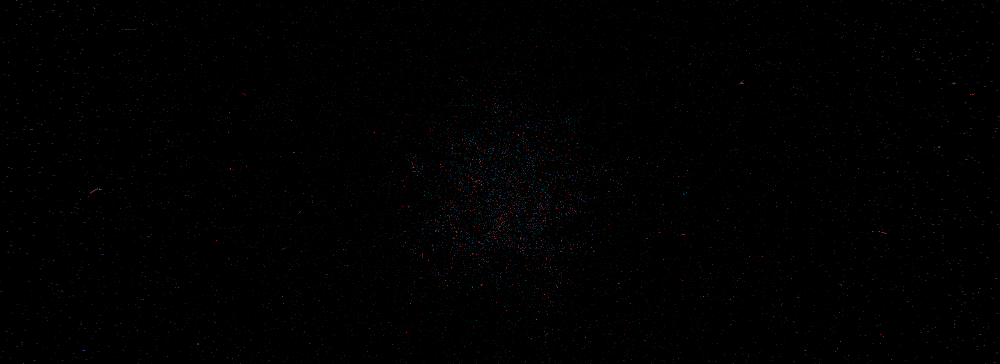
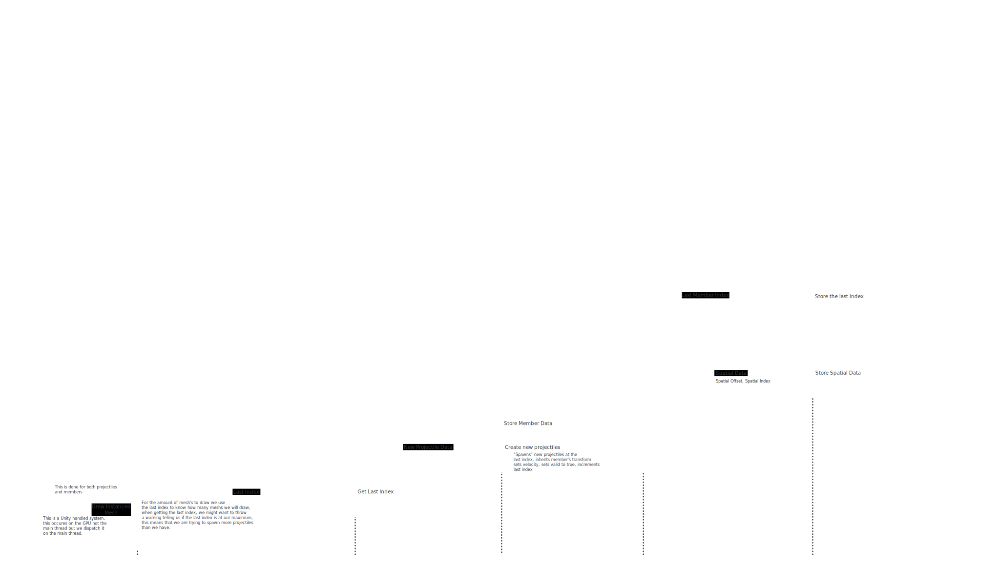

# Space Boids Sandbox Project

For a while I had been thinking about this game where you play as a captain of a large, frigate class, spaceship. And you can command smaller fighter ships that have low level AI that fight eachother. I decided to explore this using my sandbox and then things got... a bit out of hand.

I decided to turn this into an investgation into optimisation and pushing the Unity Engine to its limits. In the image depicted above, I have 200,000 spaceships fighting eachother, all of which are looking for targets, avoiding eachother, trying to aim at their target and shooting. I also have another system to handle the projectiles that in this image can handle around 70,000 projectiles. This was all running in real-time at around 40 frames-per-second.

This project works by utilising the power of the GPU. It uses Compute Shaders to handle the logic of all of the spaceships, vertex/fragment shaders and GPU instancing to draw each ship and projectile, and spatial partioning to help reduce the sizes of some loops.

Here is a diagram at how these systems work and communicate with eachother:

I took a large chunk of inspiration (and some implementation) from [Sebastian Lague's github](https://github.com/SebLague) regarding the spatial partitioning using the bitonic merge sort in his [fluid simulation](https://github.com/SebLague/Fluid-Sim) and his investigation on [boids](https://github.com/SebLague/Boids) helped sparked the initial thoughts behind the first implementations of this.

For the projectiles, I did originally explore using Unity's VFX systems or built-in particle systems. However for my usecase it became a large bottleneck having to read the buffers from the GPU to the CPU. Alternatively I devised my own solution, using compute shaders, to handle my projectiles.